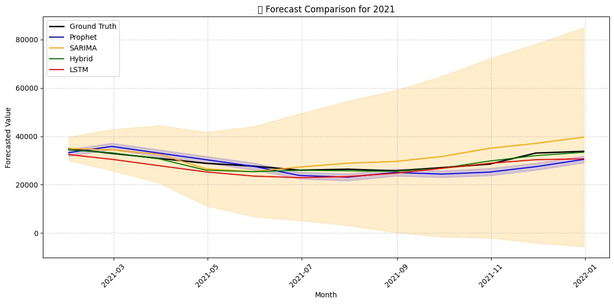
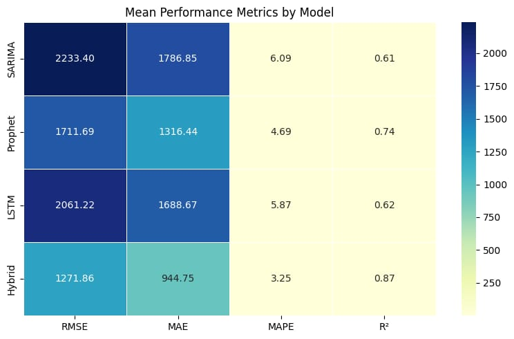
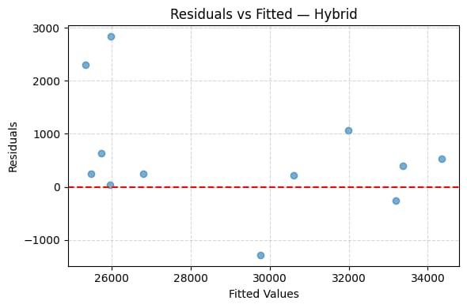
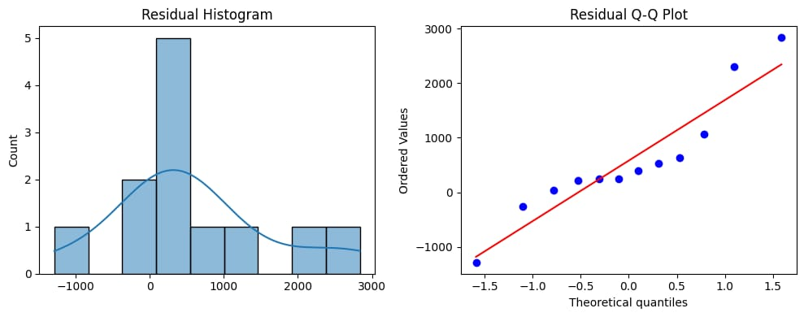

# Electricity Demand Forecasting (ARIMA-LSTM)

## Overview
This project develops a hybrid ARIMA-LSTM model to forecast electricity demand using historical time series data. Accurate demand forecasting helps support energy planning, optimise resource allocation, and reduce operational costs.

## Tools & Technologies
- Python (Pandas, NumPy, TensorFlow)
- Time Series Forecasting
- Power BI

## Results
- Achieved **2.9% MAPE**, indicating high prediction accuracy
- Hybrid model outperformed SARIMA, Prophet, and LSTM models across all evaluation metrics

## Key Features
- Combines statistical (ARIMA) and deep learning (LSTM) approaches
- Handles both linear and nonlinear patterns in time series data
- Provides more accurate and stable forecasts

## Results Visualization

### Forecast Comparison

### Model Performance

**Insight:**  
The Hybrid model achieved the lowest RMSE, MAE, and MAPE, along with the highest R² score, demonstrating superior predictive performance.

### Residual Analysis

### Residual Diagnostics

## Conclusion
The hybrid ARIMA-LSTM approach significantly improves forecasting accuracy compared to individual models. This demonstrates the effectiveness of combining statistical and machine learning techniques for real-world time series problems.

## Author
Sharmila Arockiyasamy
